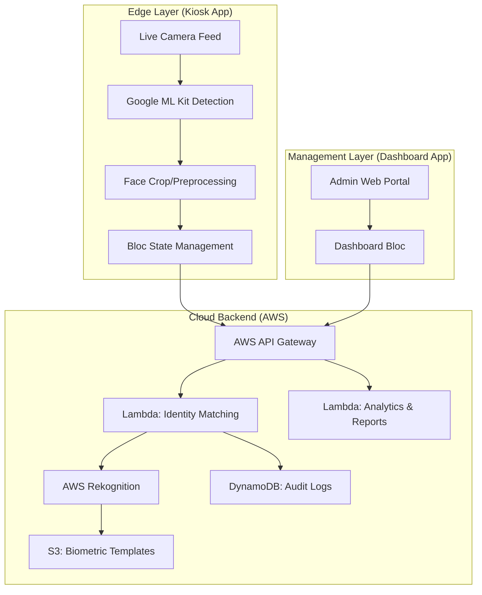

# Attendify: AI-Powered Face Recognition Attendance System

Attendify is a high-performance, decentralized attendance management solution. It uses on-device face detection and cloud-based identity verification to provide a seamless monitoring experience for institutions and enterprises.

## System Architecture

Attendify is built on a distributed **Clean Architecture** to ensure modularity, privacy, and scalability.



---

## Project Structure & Core Modules

This repository contains two primary Flutter applications. Each follows the **Clean Architecture** pattern (Data, Domain, Presentation).

### 1. Dashboard App (`/dashboard_app`)
The administrative portal for real-time monitoring and student management.
- **Data Layer**: Handles AWS API communication and DynamoDB record fetching.
- **Domain Layer**: Contains the core business logic for attendance aggregation and student enrollment.
- **Presentation Layer**: A sleek, reactive UI built with `flutter_bloc` for real-time data visualization.

### 2. Kiosk App (`/kiosk_app`)
The attendance entry station designed for physical deployment.
- **Face Detector Service**: On-device detection using ML Kit (supports Android/Web).
- **Attendance Flow**: Captures high-quality face crops and transmits them securely to the identity matching engine.
- **Offline Resilience**: Built to handle network latency with optimistic UI updates.

---

## Installation & Setup (Developer Guide)

Follow these steps to set up the project on your local machine for the first time.

### Prerequisites
- **Flutter SDK**: `^3.7.0` (Stable)
- **Git**: Installed and configured in your PATH
- **Android Studio**: Installed with Android SDK 36 (required for camera plugins)
- **AWS Access**: Reach out to the project owner for API endpoints and Cognito keys.

### 1. Clone the Repository
```bash
git clone https://github.com/thesakshidiggikar/Attendify-.git
cd Attendify-
```

### 2. Environment Configuration
Create a `.env` file in **both** project roots (`/dashboard_app` and `/kiosk_app`).

**Template for `.env`:**
```env
API_BASE_URL=https://[your-api-gateway].execute-api.ap-south-1.amazonaws.com/default
AWS_REGION=ap-south-1
COGNITO_USER_POOL_ID=[pool-id]
COGNITO_CLIENT_ID=[client-id]
S3_BUCKET_NAME=[bucket-name]
```

### 3. Install Dependencies
Navigate into each directory and run:
```bash
flutter pub get
```

### 4. Running the Apps

#### For Dashboard (Web):
```bash
cd dashboard_app
flutter run -d chrome --web-browser-flag "--disable-web-security"
```

#### For Kiosk App (Mobile/Native):
Ensure your Android device is connected:
```bash
cd kiosk_app
flutter run
```

---

## Core Engineering Standards
- **Uni-directional Data Flow**: Powered by the BLoC pattern.
- **Dependency Injection**: Services are decoupled using the `GetIt` locator.
- **Edge ML**: Google ML Kit is used for ultra-fast face detection before cloud verification.
- **Secure Networking**: All transmissions are encrypted via TLS and protected by IAM roles.

---

## Credits & License
- **Lead Developer**: Sakshi Diggikar
- **Context**: Institutional Attendance System Project
- **University**: DYPIU

---
*Designed for security. Engineered for scale.*
