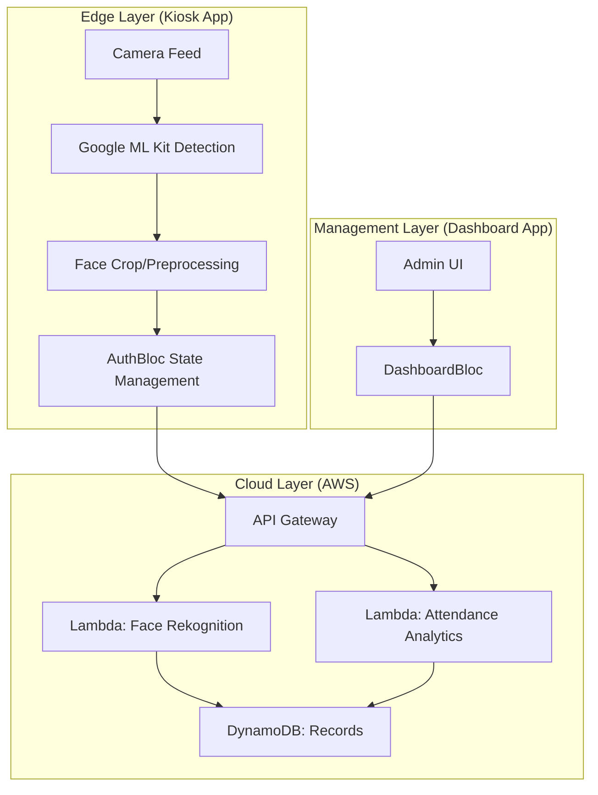

# FaceAttend: AI-Powered Enterprise Attendance System

FaceAttend is a decentralized, AI-driven attendance management solution designed for institutional scalability. Leveraging real-time on-device facial recognition and a serverless cloud backend, it provides a seamless experience for both administrators and employees/students.

## System Architecture

The project follows a distributed architecture with a clear separation between edge-processing (Kiosk) and centralized management (Dashboard).



### Edge Processing (Kiosk)
- **Face Detection**: Local, on-device detection using Google ML Kit to minimize latency and bandwidth.
- **Privacy First**: Sensitive biometric data is processed at the edge before being securely transmitted to the cloud.

### Serverless Infrastructure
- **Compute**: Event-driven AWS Lambda functions handle authentication, identity matching, and analytics.
- **Storage**: Highly available DynamoDB for structured records and S3 for secure encrypted image storage.
- **API Management**: AWS API Gateway provides a managed entry point with role-based access control.

## Engineering Standards

The codebase is engineered with high-level design patterns to ensure maintainability and testability at scale:

1.  **Clean Architecture**: Structured into Domain, Data, and Presentation layers to decouple business logic from external dependencies (frameworks, APIs).
2.  **BLoC Pattern**: Uni-directional data flow using Reactive Programming for robust state management.
3.  **Dependency Injection**: Decoupled service construction using the `GetIt` service locator.
4.  **Modular Organization**: Feature-based folder structure for independent scaling of modules (Auth, Attendance, Analytics).

## Technical Stack

- **Framework**: Flutter (Cross-platform support for Web, Mobile, and Desktop)
- **State Management**: `flutter_bloc`, `equatable`
- **Networking**: `http`, `flutter_dotenv`
- **Cloud Backend**: AWS (Lambda, API Gateway, S3, Cognito)
- **ML Engine**: Google ML Kit (Edge Detection) + AWS Rekognition (Cloud Identification)

## Core Components

### 1. Dashboard Application
A comprehensive administrative portal for:
- Real-time attendance monitoring and data visualization.
- Employee/Student database management.
- Automated report generation and analytics.

### 2. Kiosk Application
A high-performance attendance entry station featuring:
- Live holographic scanner interface.
- Instant identity verification using face-matching algorithms.
- Offline-first design principles for resilience.

## Getting Started

### Prerequisites
- Flutter SDK (latest stable)
- Git
- AWS Account (configured for the serverless backend)

### Setup
1.  **Clone the Repository**:
    ```bash
    git clone https://github.com/thesakshidiggikar/Attendify-.git
    cd Attendify-
    ```
2.  **Configure Environment**:
    Create a `.env` file in both `dashboard_app/` and `kiosk_app/` based on the provided `.env.example` templates.
3.  **Install Dependencies**:
    ```bash
    flutter pub get
    ```

## Development & Testing
Comprehensive test scripts are provided in the `/scripts` directory to verify API connectivity and logic independently of the UI.

- `test_login.py`: Validates authentication workflows.
- `test_stats.py`: Verifies real-time analytics aggregation.
- `test_get_employees.py`: Tests database retrieval latency.

---
Designed for performance, security, and scalability.
- Developed for DYPIU Projects.
